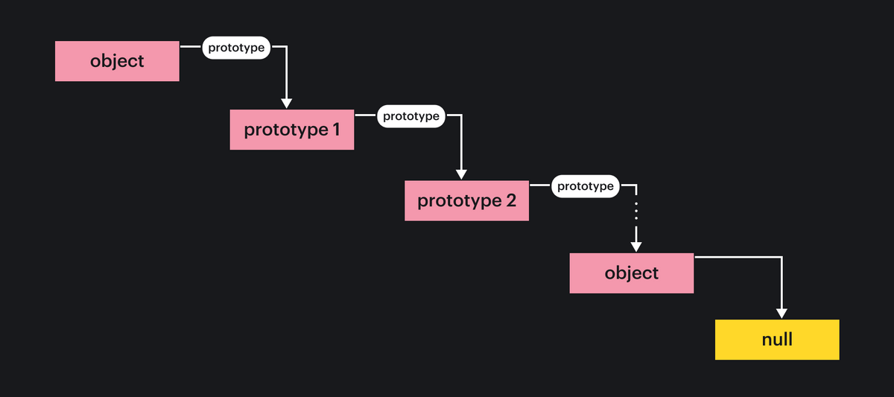

# **Прототипы**

Почти с каждым объек­том **JavaScript** ассоциирован второй объект **JavaScript**, который называется про­тотипом, и первый объект наследует свойства от прототипа.

Все объекты, создаваемые объектными литералами, имеют тот же са­мый объект-прототип, на который можно ссылаться в коде **JavaScript** как на `Object.prototype`. Объекты, создаваемые с использованием ключевого слова `new` и вызова конструктора, применяют в качестве своих прототипов значение свойства `prototype` функции конструктора. Таким образом, объект, создан­ный посредством `new Object()`, наследует `Object.prototype`, как и объект, созданный с помощью `{}`. Аналогично объект, созданный с использованием
`new Array()`, применяет в качестве прототипа `Array.prototype`, а объект, со­зданный с использованием `new Date()`, получает прототип `Date.prototype`.

Почти все объекты имеют прототип, но только относительно небольшое коли­чество объектов располагают свойством `prototype` . Именно эти объекты со свойствами `prototype` определяют прототипы для всех остальных объектов.

`Object.prototype` — один из редких объектов, не имеющих прототипов: он не наследует никаких свойств. Другие объекты-прототипы являются нор­мальными объектами, которые имеют прототип.

Связанная последовательность объектов-прототипов называется цепочкой прототипов.
***

## **Наследование**

Объекты **JavaScript** имеют набор “собственных свойств” и вдобавок наследу­ют набор свойств от своих объектов-прототипов. Предположим, что вы запрашиваете свойство `х` в объекте `о`. Если в `о` отсутст
вует собственное свойство с таким именем, тогда свойство `х` запрашивается в объекте-прототипе `о`. Если объект-прототип не имеет собственного свойства по имени `х`, но сам располагает прототипом, то запрос выполняется для про­тотипа объекта-прототипа. Процесс продолжается до тех пор, пока свойство `х` не будет найдено или не обнаружится объект с прототипом `null`. Как должно быть понятно, атрибут `prototype` объекта создает цепочку или связный спи­сок, от которого наследуются свойства:

````js
let о = {}; // о наследует методы объекта от Object .prototype
o. х = 1 ; //и теперь имеет собственное свойство х.
let р = Object.create(о); //р наследует свойства от о и Object, prototype
p. у = 2; // и имеет собственное свойство у.
let q = Object.create(р); // q наследует свойства от р, о и . ..
q. z = 3; // .. .Object.prototype и имеет собственное свойство z.
let f = q.toString() ; //toString наследуется от Object .prototype
q.x + q.y // => 3; x и у наследуются от о и p
````



Теперь предположим, что вы присваиваете значение свойству `х` объекта `о`. Если `о` уже имеет собственное (не унаследованное) свойство по имени `х`, тогда присваивание просто изменяет значение этого существующего свойства. В про­тивном случае присваивание создает в объекте `о` новое свойство по имени `х`. Если объект `о` ранее унаследовал свойство `х`, то унаследованное свойство скры­вается вновь созданным свойством с тем же самым именем. Присваивание свойства просматривает цепочку прототипов лишь для определения, разрешено ли присваивание. Скажем, если `о` наследует свойство
по имени `х`, допускающее только чтение, тогда присваивание не разрешается. Тем не менее, если присваивание разрешено, то оно всегда создает или устанав­ливает свойство в первоначальном объекте и никогда не модифицирует объек­ты в цепочке прототипов. Тот факт, что наследование действует при запраши­вании свойств, но не при их установке, является ключевой особенностью языка **JavaScript**, т.к. появляется возможность выборочно переопределять унаследован­ные свойства.

````js
let unitcircle = { r: 1 }; // Объект, от которого будет делаться наследование
let с = Object.create(unitcircle); // с наследует свойство r
с.х = 1; с.у = 1; // с определяет два собственных свойства
с.г = 2; // с переопределяет свое унаследованное свойство
unitcircle.г // => 1: прототип не затронут
````

Существует одно исключение из правила о том, что присваивание свойства либо терпит неудачу, либо создает или устанавливает свойство в первоначаль­ном объекте. Если `о` наследует свойство `х`, и оно является свойством средства доступа с методом установки, тогда вместо создания но­вого свойства `х` в `о` вызывается данный метод установки. Однако, метод установки вызывается с объектом `о`, а не объектом-прототипом, ко­торый определяет свойство, поэтому если метод установки определяет любые свойства, то они попадают в объект `о`, снова оставляя цепочку прототипов не­ затронутой.
