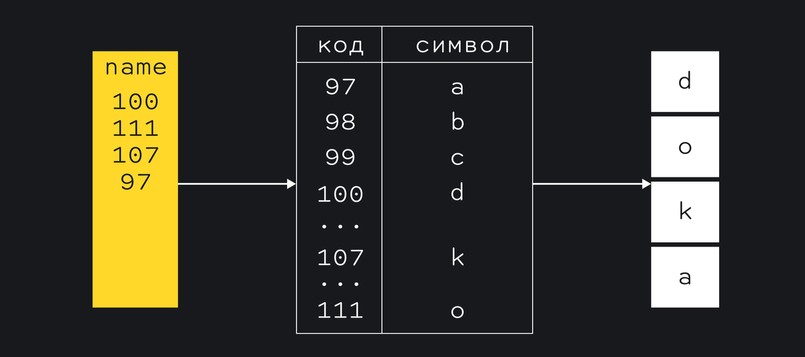

# **Строки**

Строка – это неизменяемая, упорядоченная последовательность 16-битных значений, каждое из которых обычно представляет символ Юникода. Длина строки – это количество 16-битных значений, содержащихся в ней.

Строка сложно устроена внутри, несмотря на то, что это примитив.
Символ, который видно на экране хранится в компьютере как одно или несколько чисел, каждое такое число называют юнитом. Компьютер хранит таблицу в которой числу соответствует символ. Такие таблицы называют кодировкой.

В **JavaScript** используется кодировка **UTF-16**, самая распространённая в мире. Таблица этой кодировки настолько большая, что покрывает не только все современные алфавиты и иероглифические системы записи, но и шумерскую клинопись, и древнеегипетские иероглифы. Эмодзи тоже содержатся в этой таблице, поэтому нам не нужно ничего устанавливать на компьютер чтобы видеть их 🙌



***

## **Строковые литералы**

Чтобы включить литерал строки в JavaScript-программу, достаточно просто заключить символы строки в парные одинарные или двойные кавычки (' или "). Символы двойных кавычек могут содержаться в строках, ограниченных символами одинарных кавычек, а символы одинарных кавычек – в строках, ограниченных символами двойных кавычек.

Начиная с ECMAScript 5 строковые литералы можно разбивать на несколько строк, заканчивая каждую строку, кроме последней, символом обратного слэша `(\)`. Ни один из символов обратного слэша, как и следующие за ними символы перевода строки, не будут включены в строковый литерал. Чтобы включить в строковый литерал символ перевода строки, следует использовать последовательность символов `\n`:

```` js
"две\nстроки" // Стро­ко­вый ли­те­рал, пред­став­ляю­щий две стро­ки

"од­на\
длин­ная\
стро­ка"
// Од­на стро­ка, за­пи­сан­ная в трех стро­ках. Толь­ко в ECMAScript 5
````

***

Для представления символов Юникода в языке JavaScript используется кодировка UTF-16, а строки JavaScript являются последовательностями 16-битных значений без знака. Большинство наиболее часто используемых символов Юникода (из «основной многоязыковой матрицы») имеют кодовые пункты, умещающиеся в 16 бит, и могут быть представлены единственным элементом строки. Символы Юникода, кодовые пункты которых не умещаются в 16 бит, кодируются в соответствии с правилами кодировки
UTF-16 как последовательности (известные как «суррогатные пары») из двух 16-битных значений.

```` js
var p = "π"; // π - это 1 сим­вол с 16-би­тным ко­до­вым пунк­том 0x03c0
var e = "e"; // e - это 1 сим­вол с 17-би­тным ко­до­вым пунк­том 0x1d452
p.length // => 1: p со­дер­жит един­ст­вен­ный 16-би­тный эле­мент
e.length // => 2: в ко­ди­ров­ке UTF-16 сим­вол e оп­ре­де­ля­ет­ся дву­мя 16-би­тны­ми зна­че­ния­ми: "\ud835\udc52"
````

Различные строковые методы, имеющиеся в языке JavaScript, манипулируют 16-битными значениями, а не символами. Они не предусматривают возможность специальной интерпретации суррогатных пар, не выполняют нормализацию строк и даже не проверяют, является ли строка последовательностью символов в кодировке UTF-16.

***

## **Управляющие последовательности в строковых литералах**

Символ обратного слэша `(\)` имеет специальное назначение в JavaScript-строках. Вместе с символами, следующими за ним, он обозначает символ, не представимый внутри строки другими способами - это управляющая после­довательность (escape sequence).

* `\n` – символ перевода строки
* `\'` - одинарная кавычка
* `\0` - cимвол NUL (\u0000)
* `\b` - забой (\u0008)
* `\t` - горизонтальная табуляция (\u0009)
* `\n` - перевод строки (\u000A)
* `\v` - вертикальная табуляция (\u000B)
* `\f` - перевод страницы (\u000C)
* `\r` - возврат каретки (\u000D)
* `\"` - двойная кавычка (\u0022)
* `\\` - обратный слэш (\u005C)
* `\x` - XX Символ Latin-1, заданный двумя шестнадцатеричными цифрами XX
* `\uxXXXX` - символ Unicode, заданный четырьмя шестнадцатеричными цифрами XXXX
* `\xA9` - символ копирайта

Если символ `\` предшествует любому символу, отличному от приведенных, обратный слэш просто игнорируется.

***

## **Работа со строками**

* Одной из встроенных возможностей JavaScript является способность конкатени­ровать строки. Если оператор + применяется к строкам – они объединяются, при этом вторая строка добавляется в конец первой.

* Для определения длины строки – количества содержащихся в ней 16-битных значений – используется свойство строки length `s.length`.

```` js
var s = "hello, world" // Нач­нем с то­го же тек­ста.
s.charAt(0) // => "h": пер­вый сим­вол.
s.charAt(s.length-1) // => "d": по­след­ний сим­вол.
s.substring(1,4) // => "ell": 2-й, 3-й и 4-й сим­во­лы.
s.slice(1,4) // => "ell": то же са­мое
s.slice(-3) // => "rld": по­след­ние 3 сим­во­ла
s.indexOf("l") // => 2: по­зи­ция пер­во­го сим­во­ла l.
s.lastIndexOf("l") // => 10: по­зи­ция по­след­не­го сим­во­ла l.
s.indexOf("l", 3) // => 3: по­зи­ция пер­во­го сим­во­ла "l", сле­дую­ще­го
 // за 3 сим­во­лом в стро­ке
s.split(", ") // => ["hello", "world"] раз­би­ва­ет на под­стро­ки
s.replace("h", "H") // => "Hello, world": за­ме­ща­ет все вхо­ж­де­ния под­стро­ки
s.toUpperCase() // => "HELLO, WORLD"
````

* Строки в JavaScript являются неизменяемыми. Такие методы, как replace() и toUpperCase() возвращают новые строки - они не изменяют строку, относительно которой были вызваны. В стандарте ECMAScript 5 строки могут интерпретироваться как массивы, доступные только для чтения, и вместо использования метода charAt() к отдельным символам (16-битным значениям) строки можно обращаться с помощью индексов в квадратных скобках:

```` js
s = "hello, world";
s[0] // => "h"
s[s.length-1] // => "d"
````

* Строки можно сравнивать между собой, для сравнения используется лексикографический порядок. Это означает, что первые символы алфавита считаются меньше последних.
Алгоритм посимвольно сравнивает строки до первого несовпадения, либо пока не закончится одна из строк.
Например, для произвольных строк s1 и s2:
Сравниваются символы s1[0] и s2[0]. Если символы разные, то большей будет та строка, символ которой больше. Сравнение завершено. Если первые символы совпали, аналогично проверяем вторые символы. Продолжаем, пока не найдём несовпадение или не закончится одна из строк. Если строки закончились одновременно, то они равны. Если закончилась одна из строк, то большей строкой считается строка с большим количеством символов.

```` js
console.log('А' > 'Я') // false
console.log('Кот' > 'Код') // true
console.log('Код' > 'Кодер') // false
console.log('Код' === 'Код') // true
````

Сравнение учитывает регистр букв, если необходимо регистронезависимое сравнение, то обе строки приводятся к верхнему или нижнему регистру с помощью методов toUpperCase или toLowerCase.
