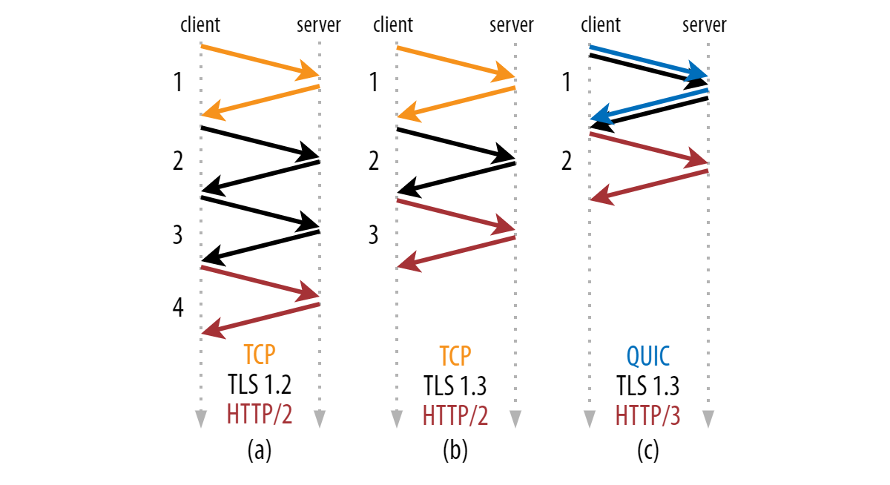
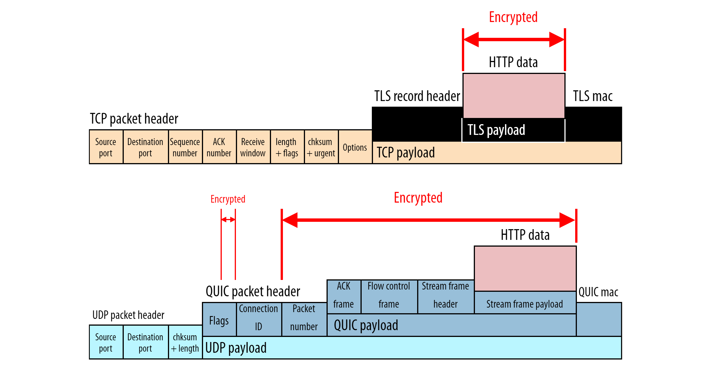

# **РАЗНИЦА МЕЖДУ HTTP/1.1 И HTTP/2**

## **Ссылки**

* [HTTP/1.1](#http11)
* [HTTP/2](#http2)
* [Модели доставки](#модели-доставки)
* [Переполнение буфера](#переполнение-буфера)
* [Прогнозирование запросов ресурсов](#прогнозирование-запросов-ресурсов)
* [Сжатие](#сжатие)
* [HTTP/3](#http3)

## **HTTP/1.1**

Разработанный Тимоти Бернерсом-Ли (Timothy Berners-Lee) в 1989 году в качестве стандарта связи для Всемирной паутины, HTTP – это протокол верхнего (прикладного) уровня, который обеспечивает обмен информацией между клиентским компьютером и локальным или удаленным веб-сервером. В этом процессе клиент отправляет текстовый запрос на сервер, вызывая метод (GET или POST). В ответ сервер отправляет клиенту ресурс, например, HTML-страницу. Этот обмен запросами и ответами можно объединить в единый прикладной уровень интернет-протоколов, расположенный над транспортным уровнем (обычно по протоколу TCP) и сетевым уровнем (по протоколу IP).

````
Хост (браузер)		Цель (веб-сервер)
↓	↑
Прикладной уровень (HTTP)	Прикладной уровень (HTTP)
↓	↑
Транспортный уровень (TCP)	Транспортный уровень (TCP)
↓	↑
Сетевой уровень (IP)	Сетевой уровень (IP)
↓	↑
Канальный уровень	Канальный уровень
————→ Интернет  ————→
````

***

## **HTTP/2**

HTTP/2 появился как протокол SPDY, разработанный в основном в Google с целью снижения задержки загрузки веб-страниц такими методами, как сжатие, мультиплексирование и приоритизация. Этот протокол послужил шаблоном для HTTP/2, когда группа httpbis (это рабочая группа Hypertext Transfer Protocol) из IETF (Internet Engineering Task Force) объединила стандарт. Так в мае 2015 года случился релиз HTTP/2. С самого начала многие браузеры (включая Chrome, Opera, Internet Explorer и Safari) поддерживали эту попытку стандартизации. Частично благодаря этой поддержке с 2015 года наблюдается высокий уровень внедрения протокола, особенно среди новых сайтов.

С технической точки зрения, одной из наиболее важных особенностей, которые отличают HTTP/1.1 и HTTP/2, является двоичный уровень кадрирования, который можно рассматривать как часть прикладного уровня в стеке интернет-протоколов. В отличие от HTTP/1.1, в котором все запросы и ответы хранятся в простом текстовом формате, HTTP/2 использует двоичный уровень кадрирования для инкапсуляции всех сообщений в двоичном формате, при этом сохраняя семантику HTTP (методы, заголовки). API прикладного уровня по-прежнему создает сообщения в обычных форматах HTTP, но нижележащий уровень преобразовывает эти сообщения в двоичные. Благодаря этому веб-приложения, созданные до HTTP/2, могут продолжать работать как обычно при взаимодействии с новым протоколом.

Преобразование сообщений в двоичные позволяет HTTP/2 применять новые подходы к доставке данных, недоступные в HTTP/1.1.
***

### **Модели доставки**

HTTP/1.1 и HTTP/2 используют одну и ту же семантику, благодаря чему запросы и ответы, передаваемые между сервером и клиентом в обоих протоколах, достигают цели в виде традиционно отформатированных сообщений с заголовками и телом, используя знакомые методы (GET и POST). Но если HTTP/1.1 передает их в виде текстовых сообщений, то HTTP/2 кодирует их в двоичный файл, что позволяет ему применять другие модели доставки.

### **HTTP/1.1: конвейерная обработка и блокировка очереди**

Первый ответ, который клиент получает на запрос GET, часто содержит не всю страницу, а ссылки на дополнительные ресурсы, необходимые для запрашиваемой страницы. Только после загрузки страницы клиент обнаруживает, что для полной визуализации от сервера требуются эти дополнительные ресурсы. Потому клиенту приходится делать дополнительные запросы для извлечения этих ресурсов. В HTTP/1.0 клиент должен был разрывать и снова создавать TCP-соединение для каждого нового запроса, а это довольно затратно с точки зрения времени и ресурсов.

HTTP/1.1 устраняет эту проблему через постоянные соединения и конвейерную обработку (pipelining). HTTP/1.1 предполагает, что TCP-соединение должно оставаться открытым, если закрытие не указано прямо. Это позволяет клиенту отправлять несколько запросов по одному и тому же соединению, не дожидаясь ответа на каждый запрос, что значительно повышает производительность по сравнению с HTTP/1.0.

К сожалению, в этой стратегии оптимизации есть узкое место. Поскольку при отправке в один и тот же пункт назначения несколько пакетов данных не могут проходить друг через друга, возникают ситуации, когда запрос в начале очереди, который не может извлечь требуемый ресурс, блокирует все запросы, находящиеся за ним. Это называется блокировкой очереди (head-of-line blocking, или HOL) и представляет собой серьезную проблему оптимизации эффективности соединения в HTTP/1.1. Добавление отдельных параллельных TCP-соединений может решить эту проблему, но в протоколе существуют ограничения на количество одновременных TCP-соединений между клиентом и сервером, и каждое новое соединение требует значительных ресурсов.
***

### **HTTP/2: преимущества двоичного уровня кадрирования**

В HTTP/2 двоичный уровень кадрирования кодирует запросы и ответы и разбивает их на более мелкие пакеты информации, что значительно повышает гибкость передачи данных.

В отличие от HTTP/1.1, который должен использовать несколько соединений TCP для снижения блокировки HOL, HTTP/2 устанавливает один объект соединения между двумя компьютерами. В этой связи есть несколько потоков данных. Каждый поток состоит из нескольких сообщений в привычном формате запрос-ответ. Наконец, каждое из этих сообщений разбивается на более мелкие блоки, называемые кадрами. На самом детальном уровне канал связи состоит из набора двоично-кодированных кадров, каждый из которых помечен для определенного потока. Идентификационные теги позволяют соединению чередовать эти кадры во время передачи и повторно собирать их на другом конце. Чередующиеся запросы и ответы могут выполняться параллельно, не блокируя следующие сообщения в очереди. Этот процесс называется мультиплексированием. Мультиплексирование решает проблему блокировки очереди, присущую протоколу HTTP/1.1, гарантируя, что ни одно сообщение не будет ждать обработки другого. Это также означает, что серверы и клиенты могут отправлять параллельные запросы и ответы, что обеспечивает больший контроль и более эффективное управление соединениями. Поскольку мультиплексирование позволяет клиенту создавать несколько потоков параллельно, этим потокам нужно только одно TCP-соединение. Наличие единого постоянного соединения для каждого источника уменьшает объем памяти и объем обработки по всей сети. Это оптимизирует использование сети и полосы пропускания и, таким образом, снижает общие расходы. Единое соединение TCP также повышает производительность протокола HTTPS, поскольку клиент и сервер могут повторно использовать один и тот же защищенный сеанс для нескольких запросов/ответов. В HTTPS во время рукопожатия TLS или SSL обе стороны договариваются об использовании одного ключа в течение сеанса. Если соединение прерывается, начинается новый сеанс, для которого требуется новый сгенерированный ключ. Таким образом, поддержание одного соединения может значительно уменьшить ресурсы, необходимые для работы HTTPS. Обратите внимание: хотя спецификации HTTP/2 не требуют использовать уровень TLS, многие основные браузеры поддерживают только HTTP/2 с HTTPS. Хотя мультиплексирование, свойственное двоичному уровню кадрирования, устраняет некоторые проблемы HTTP/1.1, проблемы с производительностью могут возникнуть из-за нескольких потоков, ожидающих одного и того же ресурса. Конструкция HTTP/2 учитывает и это, используя приоритезацию потоков.
***

### **HTTP/2: приоритезация потоков**

Приоритизация потоков не только предотвращает потенциальную проблему с запросами, конкурирующими за один и тот же ресурс, но также позволяет разработчикам настраивать относительный вес запросов для лучшей оптимизации производительности приложений. Когда клиент отправляет параллельные запросы на сервер, он может расставить приоритеты запрашиваемых им ответов, присваивая вес от 1 до 256 каждому потоку. Чем выше вес, тем выше приоритет. Кроме того, клиент также определяет зависимости между потоками (указывая ID потока, от которого будет зависеть тот или иной поток). Если родительский идентификатор опущен, считается, что поток зависит от корневого потока. Сервер использует эту информацию для создания дерева зависимостей, которое позволяет ему определять порядок, в котором запросы будут получать свои данные. Давая возможность назначать вес, HTTP/2 позволяет разработчикам лучше контролировать рендеринг веб-страниц. Протокол также позволяет клиенту изменять зависимости и перераспределять вес во время выполнения в ответ на взаимодействие с пользователем. Однако важно отметить, что сервер может изменить назначенные приоритеты самостоятельно, если определенный поток заблокирован от доступа к конкретному ресурсу.
***

### **Переполнение буфера**

В любом TCP-соединении между двумя компьютерами и клиент, и сервер имеют определенный объем буферного пространства, доступного для хранения еще не обработанных входящих запросов. Эти буферы обеспечивают гибкий учет многочисленных или особенно больших запросов, поддерживая неравномерную скорость нисходящих и восходящих соединений. Однако существуют ситуации, когда буфера недостаточно. Например, сервер может передавать большой объем данных со скоростью, с которой клиентское приложение не может справиться (из-за ограниченного размера буфера или меньшей пропускной способности). Аналогичным образом, когда клиент загружает на сервер огромное изображение или видео, буфер сервера может переполниться, что приведет к потере некоторых дополнительных пакетов. Чтобы избежать переполнения буфера, механизм управления потоком не должен позволять отправителю перегружать получателя данными.

### **В HTTP / 1.1 управление потоком основывается на базовом TCP-соединении.**

Когда это соединение инициируется, клиент и сервер устанавливают размеры буфера, используя системные настройки по умолчанию. Если буфер получателя частично заполнен данными, он сообщит отправителю свое окно приема, то есть количество доступного пространства, которое остается в буфере. Это окно приема объявляется в сигнале, известном как пакет ACK (это пакет данных, который отправляет приемник, чтобы подтвердить, что он принял сигнал открытия). Если этот объявленный размер окна приема равен нулю, отправитель не будет отправлять данные, пока клиент не очистит свой буфер и затем не запросит возобновить передачу данных. Здесь важно отметить, что использование окон приема, основанных на базовом TCP-соединении, может реализовать управление потоком на одном из концов соединения.
Поскольку HTTP/1.1 использует транспортный уровень, чтобы избежать переполнения буфера, каждое новое TCP-соединение требует отдельного механизма управления потоком.

### **HTTP/2 мультиплексирует потоки данных в одном TCP-соединении.**

В результате для регулирования доставки отдельных потоков окон приема на уровне TCP-соединения недостаточно. HTTP/2 решает эту проблему, позволяя клиенту и серверу реализовать свои собственные средства управления потоком, а не полагаться на транспортный уровень. Прикладной уровень передает доступное буферное пространство, позволяя клиенту и серверу установить окно приема на уровне мультиплексированных потоков. Это мелкомасштабное управление потоком может быть изменено или сохранено после первоначального подключения через кадр WINDOW_UPDATE. Поскольку этот метод управляет потоком данных на прикладном уровне, механизму управления потоком не нужно ждать, пока сигнал достигнет своего пункта назначения, прежде чем настраивать окно приема. Узлы-посредники могут использовать информацию о настройках управления потоком данных, чтобы определить собственное распределение ресурсов и соответственно изменить его. Таким образом, каждый сервер-посредник может реализовать свою стратегию использования ресурсов, что позволяет повысить эффективность соединения. Такая гибкость в управлении потоком может быть полезной при создании соответствующих ресурсных стратегий. Например, клиент может извлечь первое сканирование изображения, отобразить его и позволить пользователю предварительно просмотреть его, извлекая при этом более важные ресурсы. Как только клиент извлечет эти ресурсы, браузер возобновит поиск оставшейся части изображения. Это может улучшить производительность веб-приложений. С точки зрения управления потоком и приоритизации, упомянутых в предыдущем разделе, HTTP/2 обеспечивает более тонкий контроль, что открывает возможность большей оптимизации.
***

## **Прогнозирование запросов ресурсов**

В типичном веб-приложении клиент отправляет GET-запрос и получает страницу в формате HTML. Обычно это индексная страница сайта. Исследуя содержимое страницы, клиент может обнаружить, что для полной визуализации страницы ему необходимо извлечь дополнительные ресурсы, такие как файлы **CSS** и **JavaScript**. Клиент определяет, что эти дополнительные ресурсы ему нужны, только после получения ответа от исходного GET-запроса. Таким образом, он должен сделать дополнительные запросы для извлечения этих ресурсов и завершения соединения страницы. Эти дополнительные запросы в конечном итоге увеличивают время загрузки.

Однако эту проблему можно решить: поскольку сервер заранее знает, что клиенту потребуются дополнительные файлы, сервер может сэкономить время клиента, отправляя клиенту эти ресурсы прежде, чем он их запросит.

### **HTTP/1.1: встраивание ресурсов**

В **HTTP/1.1**, если разработчик заранее знает, какие дополнительные ресурсы потребуется клиентскому компьютеру для отображения страницы, он может использовать метод встраивания ресурсов для включения требуемого ресурса непосредственно в документ **HTML**, который сервер отправляет в ответ на исходный запрос **GET**. Например, если клиенту нужен определенный файл **CSS** для визуализации страницы, встраивание этого файла предоставит клиенту необходимый ресурс, прежде чем он его запросит. Это уменьшает общее количество запросов, которые клиент должен отправить на сервер. Но со встраиванием ресурсов есть несколько проблем. Встраивание в документ **HTML** – целесообразное решение для небольших текстовых ресурсов, но большие файлы в нетекстовых форматах могут значительно увеличить размер **HTML** документа, что в конечном итоге может снизить скорость соединения и вообще свести на нет исходное преимущество этой техники. Кроме того, поскольку встроенные ресурсы больше не отделены от HTML-документа, у клиента нет механизма для сокращения ресурсов или для размещения ресурса в кэше. Если ресурсу требуется несколько страниц, каждый новый HTML-документ будет содержать в своем коде один и тот же ресурс, что приведет к увеличению размера HTML-документов и времени загрузки (обработка займет больше времени, чем если бы ресурс просто кэшировался в начале). Таким образом, основным недостатком встраивания является то, что клиент не может разделить ресурс и документ.

### **HTTP/2: механизм Server Push**

Поскольку HTTP/2 поддерживает множество одновременных ответов на первоначальный GET запрос клиента, сервер может отправить клиенту ресурс вместе с запрошенной HTML-страницей, предоставляя ресурс до того, как клиент запросит его. Этот процесс называется Server Push. Таким образом, HTTP/2-соединение может выполнить ту же задачу по встраиванию ресурсов, при этом сохраняя разделение между помещаемым ресурсом и документом. Это означает, что клиент может решить кэшировать или отклонить отправленный ресурс отдельно от основного HTML-документа. Так HTTP/2 устраняет основной недостаток встраивания ресурсов. В HTTP/2 этот процесс начинается, когда сервер отправляет кадр PUSH_PROMISE, чтобы сообщить клиенту, что он собирается отправить ресурс. Этот кадр включает в себя только заголовок сообщения и позволяет клиенту заранее узнать, какой ресурс отправит сервер. Если ресурс уже кэширован, клиент может отклонить отправку, отправив в ответ кадр RST_STREAM. Кадр PUSH_PROMISE также предотвращает отправку дублированного запроса на сервер (поскольку клиент знает, какие ресурсы сервер собирается отправить). Здесь важно отметить, что Server Push делает акцент на контроль клиента. Если клиенту необходимо отрегулировать приоритет Server Push или даже отключить его, он может в любое время отправить кадр SETTINGS для изменения этой функции HTTP/2. Несмотря на то, что функция Server Push имеет большой потенциал, она не всегда оптимизирует работу веб-приложения. Например, некоторые веб-браузеры не всегда могут отменить отправленные запросы, даже если клиент уже кэшировал ресурс. Если клиент по ошибке разрешает серверу отправлять дублирующийся ресурс, Server Push может израсходовать соединение. В конце концов, принудительный Server Push должен использоваться по усмотрению разработчика.
***

## **Сжатие**

Распространенным методом оптимизации веб-приложений является использование алгоритмов сжатия для уменьшения размера HTTP-сообщений, которые передаются между клиентом и сервером. HTTP/1.1 и HTTP/2 используют эту стратегию, но в первом протоколе существуют проблемы с реализацией, которые запрещают сжатие всего сообщения.

### **Сжатие в HTTP/1.1**

Такие программы, как gzip, давно используются для сжатия данных, отправляемых в сообщениях **HTTP**, особенно для уменьшения размера файлов **CSS** и **JavaScript**. Однако компонент заголовка сообщения всегда отправляется в виде простого текста. Несмотря на то, что каждый заголовок довольно мал, объем этих несжатых данных увеличивает нагрузку на соединение по мере того как клиент отправляет больше запросов. Особенно это касается сложных веб-приложений с тяжелым **API**, которые требуют много разных ресурсов и, следовательно, много разных запросов. Кроме того, использование файлов **cookie** иногда может значительно увеличить заголовки, что, в свою очередь, увеличивает потребность в сжатии.

### **Сжатие в HTTP/2**

Одна из функций, которая постоянно всплывает при обсуждении **HTTP/2** – это двоичный уровень кадрирования, который предоставляет больший контроль над мелкими деталями. Это касается и сжатия заголовков. **HTTP/2** может отделить заголовки от остальных данных, в результате чего получаются кадр заголовка и кадр данных. Программа сжатия **HPACK** (специальная для HTTP/2) может затем сжать этот кадр заголовка. Этот алгоритм может кодировать метаданные заголовка с помощью кодирования Хаффмана, тем самым значительно уменьшая его размер. Кроме того, **HPACK** может отслеживать ранее переданные поля метаданных и дополнительно сжимать их в соответствии с динамически измененным индексом между клиентом и сервером. Используя **HPACK** и другие методы сжатия, **HTTP/2** предоставляет еще одну функцию, которая позволяет уменьшить задержку между клиентом и сервером.

## **Заключения**

(Из статьи на Хабре сентябрь 2021) Мы ждали настоящего чуда, невероятных новых фич — server-push, параллельные потоки, приоритизация… Больше не нужно будет группировать сайты, балансировать нагрузку между несколькими бэкендами и старательно оптимизировать процесс загрузки страницы. По мановению волшебной палочки сайты разгонятся в полтора раза! Прошло пять лет и теперь мы знаем, что server-push нестабилен в продакшене, потоки и приоритизация обычно реализованы не лучшим образом, а значит объединение ресурсов и даже шардинг по-прежнему вовсю используются в некоторых ситуациях (но реже). Другие механизмы, например, preload hint, часто ведут себя не так, как ожидается и имеют баги, отчего их сложно правильно использовать.

## **HTTP/3**

Стеки для HTTP/2 и HTTP/3


Десятилетиями весь интернет держался на **TCP**, но он начал устаревать ещё в конце 2000-х. Его предполагаемая замена, новый транспортный протокол под названием **QUIC**, настолько отличается от **TCP** по ключевым пунктам, что просто использовать поверх него **HTTP/2** было бы очень сложно. Поэтому сам по себе **HTTP/3** — это относительно незначительное изменение **HTTP/2** для адаптации к новому протоколу **QUIC**. Например, **TCP** требует рукопожатие для установки нового соединения, чтобы проверить, что клиент и сервер существуют и готовы обмениваться данными. Нужно сделать полный круговой путь по сети, прежде чем можно будет делать что-то ещё. Если клиент и сервер находятся далеко, время кругового пути (round-trip time, RTT) может составить более 100 мс, что приводит к ощутимым задержкам. Второй пример: **TCP** видит все данные, которые передает, как один «файл», или поток байтов, даже если мы передаем несколько файлов одновременно (например, загружаем страницу с несколькими ресурсами). На практике это означает, что, если пакеты **TCP** с данными одного файла теряются, все остальные файлы будут ждать восстановления этих пакетов. Это так называемая блокировка начала очереди — head-of-line (HoL) blocking. На практике с этими недостатками можно бороться (иначе зачем бы мы мучились с TCP целых 30 с лишним лет), но они серьезно влияют на протоколы верхнего уровня, например, **HTTP**. **TCP Fast Open** устраняет издержки рукопожатия, позволяя протоколам с верхнего уровня отправлять данные с самого начала. Ещё одно решение — **MultiPath TCP**. Здесь основная идея в том, что в мобильном телефоне обычно есть связь Wi-Fi и 4G, так почему бы не использовать их одновременно, чтобы увеличить пропускную способность и надёжность.
Реализовать эти дополнения к **TCP** не то чтобы чересчур сложно, а вот действительно развернуть их в масштабе интернета — практически невыполнимо. Поскольку **TCP** очень популярен, почти у каждого подключенного устройства есть своя реализация этого протокола. Если эти реализации слишком старые или содержат много багов, расширения будет невозможно использовать. То есть все реализации протокола должны знать о расширении, чтобы оно приносило пользу. Проблем бы не было, если бы речь шла только об устройствах конечных пользователей (компьютерах, например, или веб-серверах), потому что обновить их вручную несложно. Но существует много других устройств между клиентом и сервером, у которых есть своя реализация кода **TCP** (например, файрволы, балансировщики нагрузки, роутеры, серверы кэширования, прокси и т. д.). Промежуточные устройства обновлять сложнее, и обычно у них больше ограничений. Например, файрвол может быть настроен так, чтобы блокировать весь трафик, который содержит неизвестные расширения. На практике оказывается, что огромное число активных промежуточных устройств предъявляет к **TCP** определённые требования, которые больше не поддерживаются новыми расширениями. Получается, что развивать **TCP** практически невозможно.

* На самом деле нам нужен был не **HTTP/3**, а **TCP/2**. Всё то, чего мы ждем от **HTTP/3** (быстрая установка соединения, меньше блокировок HoL, миграция соединения и т. д.), — на самом деле уже реализовано в **QUIC**.

***

### **Что такое QUIC?**

**QUIC** — это универсальный транспортный протокол. Как и **TCP**, он может и будет использоваться в разных сценариях, не только для **HTTP** и загрузки сайтов. Например, поверх **QUIC** можно пристроить **DNS**, **SSH**, **SMB**, **RTP** и так далее. **QUIC** работает поверх ещё одного протокола — **UDP**. Это правда, но производительность тут ни при чём. В идеале **QUIC** мог бы быть полностью независимым транспортным протоколом сразу над **IP**. Но тогда возникли бы те же сложности, что и при попытке развивать **TCP**: пришлось бы сначала обновить все устройства в интернете, чтобы они распознавали и разрешали **QUIC**. К счастью, мы можем разместить **QUIC** поверх ещё одного распространённого протокола транспортного уровня: **UDP**.

* **UDP** - это максимально примитивный транспортный протокол. Он не отвечает вообще ни за что, кроме номеров портов (например, HTTP использует порт 80, HTTPS — 443, а DNS — 53). Он не устанавливает соединение с помощью рукопожатия и не обеспечивает надежность — потерянный пакет **UDP** не передаётся снова автоматически. Получается, что **UDP** работает на максимальной производительности — без ожидания рукопожатий и блокировок HoL. На практике **UDP** обычно используется для динамического трафика, который обновляется на высокой скорости и меньше зависит от потери пакетов, потому что недостающие данные всё равно быстро устаревают (например, онлайн-конференции или игры). Ещё он хорошо подходит для сценариев, где нужна минимальная задержка, например, поиск доменных имен **DNS** требует всего одной передачи туда и обратно.

Многие говорят, что **HTTP/3** создан поверх **UDP** в целях производительности. Якобы **HTTP/3** работает быстрее, потому что, как и **UDP**, не устанавливает соединение и не ждет повторной передачи пакетов. На самом деле **UDP** используется протоколом **QUIC**, а значит и **HTTP/3**, в надежде, что так их будет проще развернуть, ведь UDP уже знают и используют почти все устройства в интернете. Расположенный поверх **UDP**, **QUIC**, по сути, реализует почти все функции, которые делают **TCP** таким эффективным и популярным (пусть и чуть более медленным) протоколом. **QUIC** абсолютно надёжен — он использует подтверждение полученных пакетов и повторные передачи, чтобы добрать то, что потерялось. **QUIC** по-прежнему устанавливает соединение и использует сложную систему рукопожатий. Наконец, **QUIC** использует механизмы flow-control и congestion-control, которые не дают отправителю перегрузить сеть или получателя, но замедляют **TCP** по сравнению «чистым» **UDP**. Правда **QUIC** реализует эти функции умнее и эффективнее. В нём собраны десятилетия опыта и лучших практик **TCP** и новые функции.

В **QUIC** есть несколько новых фич и возможностей (передача данных на 0-RTT, миграция соединений, больше устойчивости к потере пакетов и медленным сетям). Вкратце, все сводится к четырём основным изменениям:

* QUIC глубоко интегрирован с TLS.
* QUIC поддерживает несколько независимых потоков байтов.
* QUIC использует идентификаторы соединений.
* QUIC использует фреймы.

Вдаваться в технические детали TLS, к счастью, не обязательно. Достаточно знать, что шифрование выполняется с помощью сложных вычислений и очень больших простых чисел. Вся эта математика согласуется между клиентом и сервером во время отдельных криптографических рукопожатий, на которые, конечно, требуется время. В предыдущих версиях TLS (допустим, 1.2 и ниже) для этого требовалось два прохода туда-обратно. К счастью, новые версии TLS (сейчас последняя версия — 1.3) обходятся всего одним, потому что TLS 1.3 использует только математические алгоритмы, которые можно согласовать за одно рукопожатие. Это означает, что клиент может сразу догадаться, какие алгоритмы поддерживает сервер, не запрашивая и не получая список.

Рукопожатия для TLS, TCP и QUIC


На заре интернета шифрование трафика было ресурсозатратным. Считалось, что это нужно только в некоторых ситуациях. Исторически сложилось, что **TLS** стал полностью отдельным протоколом, который можно использовать поверх **TCP** по желанию. Поэтому мы разделяем **HTTP** (без TLS) и **HTTPS** (с TLS). Со временем вектор развития интернета сместился в сторону принципа «защищено по умолчанию». В теории **HTTP/2** можно поместить поверх **TCP** без **TLS** (это даже определено в спецификации RFC как открытый текст HTTP/2), но ни один популярный браузер не поддерживает этот режим. В каком-то смысле создатели браузеров решили усилить безопасность в ущерб производительности. Раз теперь мы стремимся использовать **TLS** всегда, неудивительно, что создатели **QUIC** вывели этот тренд на новый уровень. Вместо того, чтобы просто не определять режим открытого текста для **HTTP/3**, они решили встроить шифрование глубоко в сам **QUIC**. В первой версии **QUIC** от Google для этого использовалась кастомная настройка, а в стандартизированном **QUIC** есть сам **TLS 1.3**. В итоге, по сути, чёткие границы между протоколами в стеке стираются, как видно на картинке выше. **TLS 1.3** по-прежнему может работать независимо поверх **TCP**, но **QUIC** уже включает в себя **TLS** — невозможно использовать **QUIC** без **TLS**, поэтому **QUIC*** (а значит и **HTTP/3**) всегда полностью зашифрован. Более того, **QUIC** шифрует почти все поля заголовков пакетов. Информация на транспортном уровне (номера пакетов, которые никогда не шифруются для TCP) больше недоступны для промежуточных точек (шифруются даже некоторые флаги заголовков пакетов).

В отличие от пары TCP + TLS, QUIC всегда шифрует метаданные на транспортном уровне в заголовке и полезной нагрузке пакета. (Примечание: размер полей нельзя менять.)


Для этого **QUIC** сначала использует рукопожатие **TLS 1.3** примерно так же, как **TCP**, чтобы установить математические параметры шифрования. Затем **QUIC** берёт инициативу и шифрует пакеты сам, а в модели TLS-over-TCP шифрованием занимается **TLS**. Такой подход дает **QUIC** несколько преимуществ:

* QUIC безопаснее для пользователей.
* Использовать QUIC с открытым текстом просто невозможно, поэтому у злоумышленников и перехватчиков меньше шансов. (Недавние исследования показали, как опасен открытый текст в HTTP/2.)
* С QUIC соединение устанавливается быстрее.
* В паре TLS-over-TCP обоим протоколам нужны отдельные рукопожатия, а QUIC объединяет транспортное и криптографическое рукопожатие в одно, экономя один цикл приема-передачи.
* QUIC проще развивать. Он полностью зашифрован, так что промежуточные устройства в сети не видят и не интерпретируют его работу, как с TCP. Поэтому новые версии QUIC будут работать так же легко, даже без обновления. Если мы захотим добавить в QUIC новые фичи, достаточно будет обновить конечное устройство, не трогая все промежуточные.

Шифрование требует больше ресурсов, и с этим связаны потенциальные недостатки нового протокола:

* Многие сети будут неохотно разрешать QUIC. Компании захотят блокировать его на файрволах, потому что он мешает обнаруживать нежелательный трафик. Интернет-провайдеры и промежуточные сети будут его блокировать, потому что с ним сложнее определять разные метрики для диагностики, вроде средних задержек и процента потери пакетов. Это значит, что QUIC, скорее всего, никогда не будет использоваться повсюду
* У QUIC высокие издержки на шифрование. QUIC шифрует через TLS каждый пакет по отдельности, а в TLS-over-TCP несколько пакетов шифруется за раз. Если трафик интенсивный, QUIC может работать медленнее.
* QUIC приводит к централизации. Часто можно услышать, что Google продвигает QUIC, чтобы получить полный доступ к данным и при этом не делиться ими ни с кем. Во-первых, QUIC скрывает от внешних наблюдателей не больше (и не меньше!) пользовательской информации (например, по каким URL вы переходите), чем TLS-over-TCP. В этом плане никаких изменений. Во-вторых, хотя проект по QUIC затеяла Google, окончательные варианты протокола разработаны обширной командой Internet Engineering Task Force (IETF). QUIC IETF очень отличается от QUIC Google в техническом плане. Хотя в IETF и правда по большей части собрались ребята из крупных компаний, вроде Google и Facebook, и CDN, например, Cloudflare и Fastly. Из-за сложного устройства QUIC как раз у этих компаний будет достаточно знаний, чтобы правильно и эффективно развернуть HTTP/3 на практике. Возможно, это усилит централизацию, и это действительно смущает.

### **Решить проблему блокировки HoL на транспортном уровне было одной из главных целей QUIC.**

В отличие от **TCP**, **QUIC** прекрасно понимает, что передаёт несколько независимых потоков байтов. Он, понятно, не в курсе, что передаёт **CSS**, **JavaScript** и изображения, но знает, что это отдельные потоки. Поэтому **QUIC** обнаруживает потерю и восстанавливает пакеты для отдельных потоков.
***

### **QUIC поддерживает миграцию соединений**

Третье серьезное улучшение — в **QUIC** соединения могут дольше оставаться активными.

* Обычно все говорят о TCP-соединении, когда между двумя конечными точками (допустим, браузером или клиентом и сервером) произошло рукопожатие. Поэтому часто (и не совсем справедливо) считается, что UDP не связан с соединением, ведь рукопожатия здесь нет. На самом деле, рукопожатие не так важно. Это просто отправка и получение нескольких пакетов в определённой форме. У него несколько целей, и главная из них — убедиться, что на том конце что-то есть, и оно готово и способно с нами взаимодействовать. Повторюсь: QUIC тоже выполняет рукопожатие, хотя работает поверх UDP, у которого рукопожатий нет.

* В интернете для маршрутизации пакетов между двумя конечными точками используются IP-адреса. Но недостаточно просто подключиться к IP-адресам телефона и сервера, потому что обоим устройствам нужна возможность запускать несколько сетевых программ одновременно. Поэтому каждому соединению назначается номер порта на обоих устройствах, чтобы можно было различать эти соединения и приложения, которым они принадлежат. У серверных приложений обычно фиксированный номер порта в зависимости от функции (например, порты 80 и 443 для HTTP(S) и 53 — для DNS), а клиенты выбирают свои номера для каждого соединения отчасти рандомно. Чтобы определить уникальное соединение между машинами и приложениями, мы используем четыре компонента: IP-адрес клиента + порт клиента + IP-адрес сервера + порт сервера. В TCP соединения определяются этими четырьмя параметрами. Если один из них меняется, соединение разрывается и приходится устанавливать новое (с новым рукопожатием). TCP был изобретен задолго до того, как появились сотовые сети и смартфоны, у него нет механизма, с помощью которого клиент мог бы сообщить серверу, что сменил IP. Там нет даже способа «закрыть» соединение, потому что команда сброса или завершения, отправленная по соединению со старыми четырьмя параметрами, даже не дойдет до клиента. Поэтому на практике при каждой смене сети существующие TCP-соединения больше нельзя использовать. Нужно новое рукопожатие TCP (и, возможно, TLS), чтобы установить новое соединение. В зависимости от протокола на уровне приложений придется перезапустить некоторые действия. Например, если вы загружали большой файл по HTTP, возможно, придется повторно запросить файл (например, если сервер не поддерживает запросы на диапазон). Ещё один пример — веб-конференция в реальном времени будет ненадолго прерываться при смене сетей. Перезапуск TCP-соединений мешает работе (приходится ждать новых рукопожатий, перезапускать загрузку, снова устанавливать контекст). Чтобы решить проблему, QUIC вводит новую концепцию — идентификатор соединения CID. Каждому соединению между двумя конечными точками помимо четырёх параметров присваивается уникальный номер (На самом деле клиент и сервер договариваются об общем списке рандомно генерируемых CID, которые связаны с одним и тем же соединением).

* Поскольку CID определяется на транспортном уровне в самом QUIC, он не меняется при перемещении между сетями. Для этого CID указывается перед каждым пакетом QUIC наряду с IP-адресами и портами. Это один из немногих компонентов в заголовке пакета QUIC, который не зашифрован. При таком раскладе, даже если один из четырех параметров изменится, серверу и клиенту нужно будет просто посмотреть на CID, чтобы узнать старое соединение и дальше использовать его. Новое рукопожатие можно опустить, состояние загрузки сохранится. Обычно это называется миграцией соединения. В теории это позволит повысить производительность, но тут тоже есть свои нюансы.

* У CID, конечно, есть недостатки. Например, если мы будем использовать один CID, хакерам будет очень просто отслеживать пользователей по сетям и хотя бы приблизительно определять, где они находятся. Чтобы избежать этих проблем, QUIC меняет CID при каждом переходе в новую сеть.

***

### **Гибкость и простота развития QUIC**

1. QUIC почти полностью зашифрован, так что, если мы захотим развернуть его новую версию, обновлять нужно будет только конечные точки (клиенты и серверы), а не промежуточные устройства. На это, конечно, тоже потребуется время, но речь идёт о месяцах, а не годах.

2. в отличие от TCP, QUIC не использует один фиксированный заголовок пакета для отправки всех метаданных протокола. Вместо этого QUIC использует короткие заголовки пакета и разные фреймы (такие миниатюрные специализированные пакеты) в полезной нагрузке пакета, чтобы передать дополнительную информацию. Есть, например, фрейм ACK (acknowledgement — подтверждение), NEW_CONNECTION_ID (для миграции соединения) или STREAM (для передачи данных). Это сделано для оптимизации, потому что не каждый пакет содержит все возможные метаданные (заголовки пакетов в TCP весили лишние байты). Ещё один плюс фреймов — в будущем можно будет легко добавлять в QUIC их новые разновидности. Например, фрейм DATAGRAM, которые позволяет отправлять ненадёжные данные по зашифрованному QUIC-соединению.

3. QUIC использует кастомное расширение TLS для передачи параметров транспорта, чтобы клиент и сервер могли выбирать конфигурацию для QUIC-соединения. То есть они могут согласовать используемые функции (например, нужно ли разрешить миграцию соединения, какие расширения поддерживаются и т. д.) и передавать важные параметры по умолчанию для некоторых механизмов (например, максимальный поддерживаемый размер пакета, лимиты flow-control). В стандарте QUIC определён длинный список таких параметров, но можно определять и новые, что делает протокол ещё более гибким.

4. сам QUIC этого не требует, но сейчас большинство реализаций выполняется в пользовательском пространстве (а не в пространстве ядра, как у TCP). По сути это означает, что нам будет гораздо проще экспериментировать с вариациями реализаций и расширениями QUIC и развёртывать их, чем это было с TCP.
