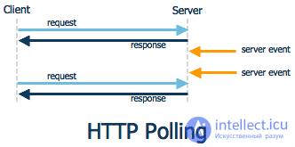
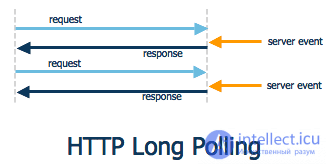
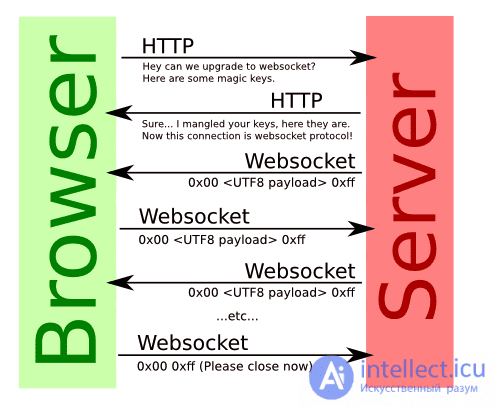
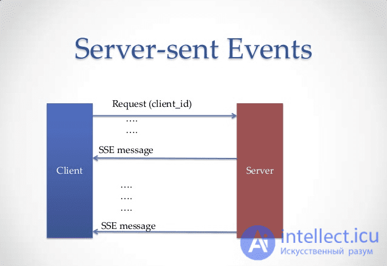

# **Pooling LongPooling ServerSaidEvents WebSocket**

## **Ссылки**

* [**Pooling**](#pooling)
* [**LongPooling**](#longpooling)
* [**WebSockets**](#websockets)
* [**Server-Sent Events**](#server-sent-events)
* [**WebRTC**](#webrtc)

***

## **Pooling**



Самый простой, но самый не эффективный, метод: клиент раз в несколько секунд опрашивает сервер на наличие событий. Даже если ничего нет, то клиент все равно делает запрос.

Плюсы:

* Просто
* Данные могут быть пожаты

Минусы:

* Очень много лишних запросов
* События всегда приходят с опозданием
* Серверу приходится хранить события пока клиент не заберет их или пока они не устареют

***

## **LongPooling**



Клиент отправляет запрос на сервер, сервер держит открытым соединение пока не придут какие-нибудь данные или клиент не отключится самостоятельно. Как только данные пришли — отправляется ответ и соединение закрывается и открывается следующее.

Плюсы по сравнению с **Polling**:

* Минимальное количество запросов
* Высокая временная точность событий
* Сервер хранит события только на время реконнекта

Минусы по сравнению с Polling:

* Более сложная схема

***

## **WebSockets**



**WebSocket** - это протокол связи с компьютером который обеспечивает полнодуплексный каналы связи через одиночное **TCP**-соединение.

### **Особенности протокола**

* Отличается от **HTTP**, но совместим с ним.
* Находится на уровне 7 в модели **OSI** и зависит от **TCP** на уровне 4.
* Работает через порт 80 и 443 (в случае шифрования **TLS**) и поддерживает **HTTP**-прокси и посредников. Для достижения совместимости при подтверждении связи **WebSocket** используется заголовок **Upgrade** для обновления протокола до протокола **WebSocket**.

Плюсы по сравнению с **LongPolling**:

* Поднимается одно соединение
* Предельно высокая временная точность событий
* Управление сетевыми сбоями контролирует браузер
* Протокол **WebSocket** обеспечивает взаимодействие между клиентом и веб-сервером с меньшими накладными расходами, обеспечивая передачу данных в реальном времени с сервера и на сервер.
* Основное преимущество серверной части **WebSockets** заключается в том, что это не **HTTP**-запрос (после рукопожатия), а правильный протокол связи на основе сообщений. Это позволяет достичь огромных преимуществ в производительности и архитектуре. Например, в **node.js** вы можете использовать одну и ту же память для разных соединений сокетов, чтобы каждый из них мог получить доступ к общим переменным. Следовательно, вам не нужно использовать базу данных в качестве точки обмена посередине. Вы можете хранить данные в ОЗУ или даже сразу же повторно публиковать их между сокетами.

Минусы по сравнению с **LongPolling**:

* **HTTP** не совместимый протокол, нужен свой сервер, усложняется отладка

***

## **Server-Sent Events**



**SSE** — клиент подписывается на события сервера и как только происходит событие — клиент сразу же получает уведомление и некоторые данные, связанные с этим событием.
Клиент отправляет запрос на сервер, сервер в ответ отправляет следующий заголовок:

`Content-Type: text/event-stream`

И не закрывает соединение. Чтобы отправить клиенту какие-то данные сервер пишет в сокет строку:

`data: My message\n\n`

На клиенте все будет выглядеть следующим образом:

````js
const source = new EventSource('http://localhost/stream.php');

source.addEventListener('message', function(e) {
  // Пришли какие-то данные
  console.log(e.data);
}, false);

source.addEventListener('open', function(e) {
  // Соединение было открыто
}, false);

source.addEventListener('error', function(e) {
  if (e.eventPhase == EventSource.CLOSED) {
    // Соединение закрыто
  }
}, false);
````

***

## **WebRTC**

**WebRTC** - это бесплатный открытый проект, который предоставляет браузерам и мобильным приложениям функции связи в реальном времени (**RTC**) с помощью простых **API**.
С помощью **Web Real-Time Communication** современные веб-приложения могут легко передавать аудио и видео контент миллионам зрителей.

Ключевые различия между **WebSockets** и **WebRTC**

* **WebSocket** - это компьютерный коммуникационный протокол, тогда как **WebRTC** - это бесплатный проект с открытым исходным кодом, который позволяет браузерам и мобильным приложениям поддерживать коммуникационные возможности.
В центре внимания **WebSockets** находятся богатые веб-приложения, а в **WebRTC** - быстрые и простые одноранговые соединения.
* **WebRTC** используется для большего количества приложений реального времени по сравнению с **WebSockets**
* Среда для **WebSockets** - это **Java**, **JMS** и **C++**, тогда как среда для **WebRTC** - это **Java** и **HTML**.
* У **WebSockets** больше проблем с безопасностью по сравнению с **WebRTC**, где основной задачей безопасности является маршрут, через который осуществляется сетевое взаимодействие.
* С точки зрения масштабируемости **WebSockets** использует сервер за сеанс, тогда как **WebRTC** является более одноранговым.
* **WebRTC** предназначен для высокопроизводительной, высококачественной передачи видео, аудио и произвольных данных.
* Приложениям **WebRTC** требуется сервис, с помощью которого они могут обмениваться метаданными сети и мультимедиа - процесс, известный как сигнализация. **WebSocket** предназначен для двунаправленной связи между клиентом и сервером. Можно передавать и обмениваться аудио и видео через **WebSocket**, но **API** недостаточно надежен, как их аналогичные функции в **WebRTC**.

***
