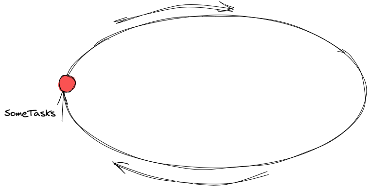
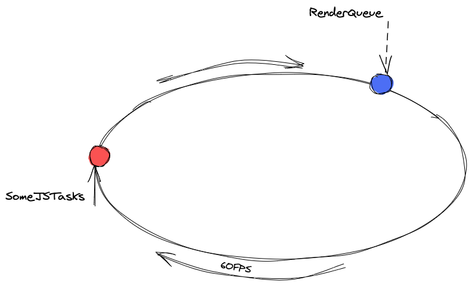
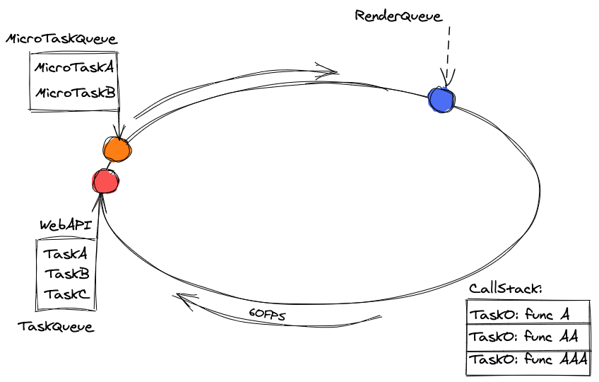
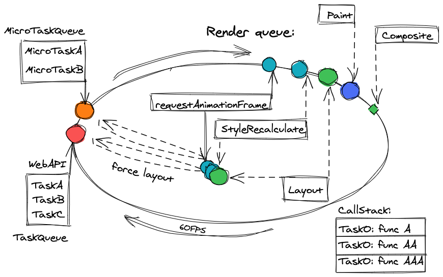

# Evevnt Loop

## **Ссылки**

* [**как работает**](#разбор-как-работает-event-loop)
* [**TaskQueue**](#taskqueue)
* [**MicroTask**](#microtask)
* [**Что исполняется внутри RenderQueue**](#что-исполняется-внутри-renderqueue)

***

## **Разбор как работает event loop**

* Есть бесконечный цикл, который опрашивает, есть ли у активные задачи:



* Эти задачи получать. Триггером, чтобы JS код начал выполняться может быть:
    1. Браузер загрузил тег `<script>`
    2. Отложенные задачи: `setTimeout`, `setInterval`, `requestIdleCallback`
    3. Ответ от сервера через `XmlHttpRequest`, `fetch` и т.п.
    4. События и вызовы подписчиков через браузерное **API**: `click`, `mousedown`, `input`, `blur`, `visibilitychange`, `message` и т.д.
    5. Изменение состояния промисов.
    6. Обзерверы, такие как: `DOMMutationObserver`, `IntersectionObserver`, `RequestAnimationFrame`

Почти все эти вызовы планируются через **WebAPI** (браузерное API). **JS** коду нужно как-то взаимодействовать с **DOM**. Считывать размеры элементов, добавлять свойства, рисовать какие-нибудь выпадающие элементы. Делать интерфейс живым. Это накладывает ограничения на отрисовку элементов. Нельзя запустить 2 потока, чтобы в одном выполнялся **JS**, а в другом **CSS** и отрисовка. Это потребовало бы большого количества синхронизаций кода, либо могло бы привести к неконсистентому исполнению. Поэтому и **JS**, и расчет отображения элементов (расположения, цвета и т.д.) работают в одном потоке. В **Event Loop** кроме **JS** есть "отрисовка" - **render queue**:



* Теперь есть две точки входа. Одна для большинства **JS** операций, другая для отрисовки. Для исполнения большей части **JS** кода есть 2 очереди:

    1. **TaskQueue** — здесь почти все ивенты, отложенные задачи и т.п.  Задача из этой очереди **Task**
    2. **MicroTaskQueue** — здесь обработка промисов и **MutationObserver**. Из этой очереди: **MicroTask**

***

### **TaskQueue**

Как только задачи набиваются в очередь **Task**, на каждом витке **event loop** достается верхний таск и исполняется. Если остается достаточно времени, т.е. в **render queue** не появилось тасков, можно достать еще одни таск и т.д., пока не придет время для отрисовки нового кадра пользователю. **Event Loop** не умеет предсказывать, сколько времени будет исполняться тот или иной таск. И он не умеет приостанавливать таск для того, чтобы отрендерить страницу пользователя, так как браузерный движок не может знать, можно ли отрисовать то, что изменил **JS** или это только подготовка элементов для отображения их пользователю. То есть: **Пока исполняется синхронный JS код, изменения не будут отображены пользователю, но могут быть посчитаны**.

***

### **MicroTask**

Микротаски ограничены. Это либо колбеки для `promise`, либо `mutationObserver`. Сама идея появления микротасок довольно костыльна, но она дает некоторые преимущества и недостатки по сравнению с `TaskQueue`. Главная особенность микротасков: они будут исполнены сразу же, как только освобождается **Стек вызовов** (это список, который отражает, какие функции сейчас вызываются и куда будет совершен переход, после окончания исполнения текущей функции). Любой **JS** код записывается в стек вызовов, что логично. Окончание стека вызовов, по сути, и есть окончание таска или микротаска. Интересный факт: Микротаски могут порождать другие микротаски, которые будут вызываться сразу же по освобождению стека вызовов. То есть рендер страницы может откладываться бесконечно. Это главный минус микротасков. Если есть 4 микротаски в очереди **MicrotaskQueue**, то они будут исполнены друг за другом, откладывая ререндер. Недостаток микротасок — также и их преимущество. Например, момент срабатывания `MutationObserver` — это когда изменения на странице произошли, но пользователь их не увидит, пока колбек `mutation observer` не исполнится. Таким образом, можно эффективно управлять контентом, который видит пользователь.



***

## **Что исполняется внутри RenderQueue**

Рендер кадра можно поделить на несколько основных этапов. Каждый этап внутри может быть разделен на другие подэтапы:

* **RequestAnimationFrame (raf)** - браузер готов начать рендер, позволяет подписаться и запланировать изменения в **DOM** прямо перед отрисовкой страницы. Несколько важных фактов:
    1. колбек для **raf** принимает аргумент  `DOMHighResTimeStamp` — количество миллисекунд прошедших с начала жизни документа. Поэтому внутри колбека можно не брать время через `perfomance.now`, нужное время уже присутствует
    2. аналогично `setTimeout`, **raf** возвращает дескриптор (`id`), поэтому запланированный **raf** можно отменить через `cancelAnimationFrame`.
    3. если пользователь переключился на другой таб, свернул браузер — перерисовки страницы не происходит. **Raf** тоже не вызывается
    4. **JS** код, который изменяет размеры элементов, считывает свойства, может зафорсить **requestAnimationFrame**
    5. Посмотреть как часто браузер обновляет кадр:

    ````js
    const checkRequestAnimationDiff = () => {
        let prev;
        function call() {
            requestAnimationFrame((timestamp) => {
                if (prev) {
                    console.log(timestamp - prev); // Должно быть в районе 16.6 мс, при 60FPS
                }
                prev = timestamp;
                call();
            });
        }
        call();
    }
    checkRequestAnimationDiff();
    ````

    6. Сафари вызывает(ал) **raf** после отображения кадра, а не до.

* **Style (recalculation)**

Браузер пересчитывает стили, которые должны примениться из-за изменений, запланированных **JS**. Здесь же происходит вычисление активных `media queries`. Пересчет включает в себя как прямые изменения `a.styles.left = '10px'` так и те, которые описываются через **CSS** файлы, например `element.classList.add('my-styles-class')`. Все они будут пересчитаны с точки зрения работы **CSSOM** и получения **Render tree**.

* [**Layout**](./Layout_Painting_Compositing.md)

Вычисление слоев, расчет положения элементов на странице, их размеров, взаимного влияния друг на друга. Чем больше **DOM** элементов на странице, тем тяжелее эта операция. Современные браузеры могут организовывать рендер и **layout** дерева по-разному. Например, в Хроме, кроме **Layout** в профилировщике вы увидите такие процессы как **update layer tree** и **layout shift**, который и отвечает за сдвиг элементов относительно друг друга. Таким образом, **event loop** превращается из одного витка в несколько, потому что и на этапе **tasks**, и на этапе **microtasks** можно запустить **force layout**:



* [**Paint**](./Layout_Painting_Compositing.md)

На этом шаге отрисовываются элементы, применяются стили `color`, `background` и т.д. Во время первого рендера сайта на это тратиться достаточно много времени. В целом, эта операция не критична, так как в общем случае она не занимает много времени. Особенно после первого рендера.

* [**Composition**](./Layout_Painting_Compositing.md)

Задача этой операции: совместить слои и получить готовый кадр.

